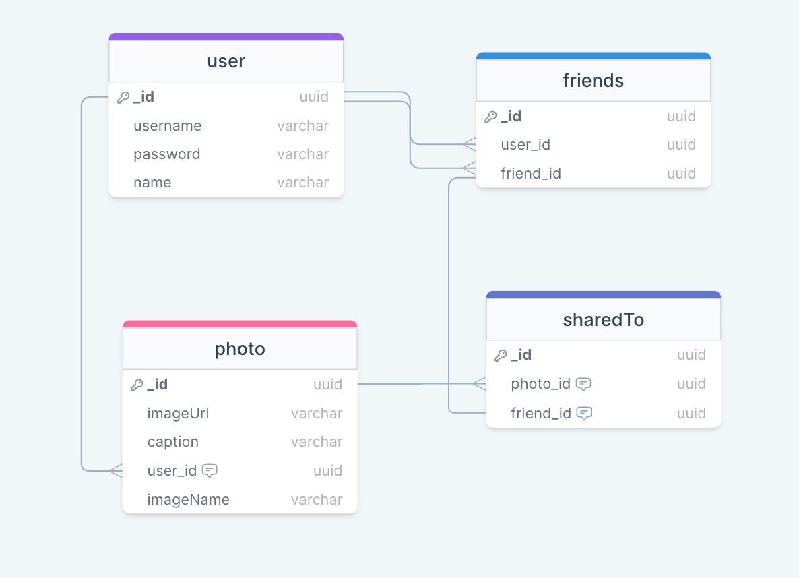

## Snapshot  - Backend

Creating a webapi to provide a full crud backend to support an application where a user can create an account, upload and share photos. 

### [Link to Deployed Backend](https://snapshot-f9oq.onrender.com)

### Technologies Used
- JavaScript
- TypeScript
- Express.js
- Node.js
- Mongo DB
- Mongoose

### Models

### Backend Route Table

| Name    | URL    | HTTP Verb |Description|
| :---    | :----: | :----:    |      :----   |
| Index   | /api/photos/user/:userid    | GET      | Display a list of photos for the user|
| Show    | /api/photos/photo:id | GET     | Display a specific photo|
| Create  | /api/photos     | POST    | Add a new photo|
| Update  | /api/photos/:photoid | PUT     | Update a specific photo|
| Delete  | /api/:photoid | DELETE  | Delete a specific photo|
| Create  | /api/sharedTos | POST  | Create shared record for photo|
| Index  | /api/sharedTos| GET  | Get all records of sharedTos |
| Index | /api/sharedTos/:photoid | GET  | Get all records of sharedTos for specific photo|
| Index  | /api/sharedTos/friend/:friendId | GET  | Get all records of sharedTos for specific friend |
| Delete  | /api/sharedTos/:photoId/friend/:friendId | DELETE  | Delete record of sharedTo Photo |
| Create  | /api/users | Create  | Create a new user account |
| Index  | /api/users | GET  | Get all users |
| Index  | /api/users/login | GET  | Get auth token for user |
| Index  | /api/users/:userId | GET  | Get logged in user info |
| Update  | /api/users/:userId | PUT  | Update user info |
| Delete  | /api/users/:userId | DELETE  | Delete user info |
| Index  | /api/imagekit-auth | GET  | Get auth token for imagekit |

### User Stories

- As a user, I can see a list of all my uploaded pictures when I visit the page
- As a user, I can see detailed information about a specific photo
- As a user, I can create a new photo upload and add it to the database
- As a user, I can update any specific photo
- As a user, I can delete any specific photo upload that I need removed
- As a user, I can add friends to see my photos
- As a user, I can delete friends I have previously added to friends list
- As a user, I can see my friends photos shared with me
- As a user, I can share my photos with my friends list

